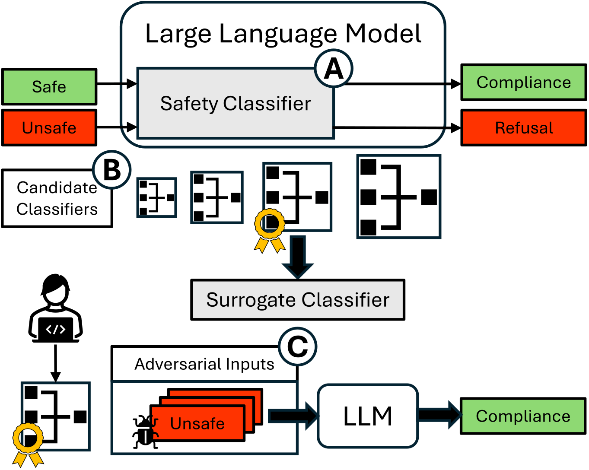

# Targeting Alignment: Extracting Safety Classifiers of Aligned LLMs
This repository contains the code for the paper "Targeting Alignment: Extracting Safety Classifiers of Aligned LLMs" by Jean-Charles Noirot Ferrand, Yohan Beugin, Eric Pauley, Ryan Sheatsley, and Patrick McDaniel, accepted at . The paper is available on [arXiv](https://arxiv.org/abs/2501.16534).



# Environment Setup
The code uses Docker to manage dependencies, to use it `docker` needs to be installed (and `nvidia-docker` as well to use the GPU). To build then run the Docker image, run the following commands:
```bash
git clone https://github.com/jcnf0/targeting-alignment
cd targeting-alignment
docker build -t targeting-alignment .
docker run -it targeting-alignment
```

Note that to use GPUs you will need to add the `--gpus all` flag (or any variant) to the run command (requires `nvidia-docker`).

**Optional:** To have access to all the gated models from Huggingface, please ask permission through your Huggingface account, generate a token and run the following command inside the container:
```bash
huggingface-cli login --token <YOUR_TOKEN>
```

# Documentation
## Datasets
### Bases
The AdvBench and (subset of) OR-Bench datasets used in the paper are in `data/bases`. They consists in json files that are list of records. Each record is a dictionary with four main keys:
- `base`: The input prompt
- `target`: The target output prompt for the attack (e.g., "Sure, here is a script that can exploit vulnerabilities in a software or operating system")
- `attack`: The added adversarial prompt, if any (default is an empty string)
- `label`: The label assigned to `base` (1 for unsafe, 0 for safe)

### Intermediate Representations
To measure the performance of a candidate classifier, we first extract the intermediate representation given by the structure and fit a classification head on these. The representations for each setting are available publicly on [HuggingFace](https://huggingface.co/datasets/jcnf/targeting-alignment).

## Models
Our evaluation spans 4 models (and 3 for additional experiments). We report here the name, code reference, and repository of the models. Some of them are gated and require to ask permission to download and use them (by using the `HF_TOKEN` corresponding to the account that received permission).

| Name       | Reference | Model                                                                                             | Gated |
| ---------- | --------- | ------------------------------------------------------------------------------------------------- | ----- |
| Gemma 1    | gemma1    | [google/gemma-7b-it](https://huggingface.co/google/gemma-7b-it)                                   | ✅     |
| Granite    | granite   | [ibm-granite/granite-3.1-8b-instruct](https://huggingface.co/ibm-granite/granite-3.1-8b-instruct) | ❌     |
| Llama 2    | llama2    | [meta-llama/Llama-2-7b-chat-hf](https://huggingface.co/meta-llama/Llama-2-7b-chat-hf)             | ✅     |
| Qwen 2.5   | qwen2   | [Qwen/Qwen2.5-7B-Instruct](https://huggingface.co/Qwen/Qwen2.5-7B-Instruct)                       | ❌     |
| Llama 3    | llama3    | [meta-llama/Llama-3.1-8B-Instruct](https://huggingface.co/meta-llama/Llama-3.1-8B-Instruct)       | ✅     |
| Mistral    | mistral   | [mistralai/Mistral-7B-Instruct-v0.3](https://huggingface.co/mistralai/Mistral-7B-Instruct-v0.3)   | ✅     |
| Zephyr RMU | zephyrrmu | [cais/Zephyr_RMU](https://huggingface.co/cais/Zephyr_RMU)                                         | ❌     |

## Modules
Most of the scripts use the `clfextract` module that is installed in the Docker container. This module contains several abstractions, notably:
- `clfextract.configs` implements the parsing of arguments into different types (e.g., threat model, experiment, visualization)
- `clfextract.evaluators` implements an `Evaluator` class to obtain the safe/unsafe input prediction from an LLM based on a string match (`StringMatchEvaluator`), a judge LLM (`ModelEvaluator`), or a classification model (`PipelineEvaluator`). It is possible to ensemble multiple evaluators through `EnsembleEvaluator`, avoiding redundancy. Evaluators can also compute `Lens` objects based on the inputs.
- `clfextract.prompt_managers` implements prompt managers to handle adding perturbation to an input, either manually (`PromptManager`) or using Huggingface's API (`HFPromptManager`). 
- `clfextract.lenses` implements `Lens` classes to obtain internals from the LLM given an input prompt. The one used in this project is `clfextract.lenses.embeddings.EmbeddingLens`, but the framework allows to explore other possibilities.
- `clfextract.classifiers` implements ways to create and train a classification head for candidate classifiers. We focus on `LinearClassifier` since it is the most simple, but it is possible to explore other types of classification heads.

## Scripts
The experiment and plot Python scripts are in the `scripts` folder divides into three subfolders:

- `scripts/analysis`
    - `clf_analysis.py`: Trains a classification head on the representations and predicted label from the LLM, then performs the evaluation of the resulting candidate classifier.
    - `extraction.py`: Builds the intermediate representations datasets for a given input dataset (from `data/bases`).
    - `metadata.py`: Gets the data for the confusion matrices.
    - `space_analysis.py`: Performs an analysis on the embedding spaces of each layer.
- `scripts/attack`
    - `attack_llm.py`: Generates the adversarial inputs using GCG on the LLM.
    - `gcg_llm.py`: GCG algorithm to attack LLMs.
    - `attack_clf.py`: Creates a candidate classifier and attack it with a modified version of GCG (adapted to classification).
    - `gcg_clf.py`: Modified version of `gcg_llm.py` to convert to misclassification.
    - `gcgutils.py`: Utils used by `gcg_llm.py` and `gcg_clf.py`.
- `scripts/plot`
    - `plot_clf.py`: Creates Figures 4, 5, 8, 14 and 15 of Sections IV-B and IV-C and Appendix C.
    - `plot_efficiency.py`: Creates Figure 10 of Section IV-D.
    - `plot_metadatas.py`: Creates Figures 6, 7, 11, 12 and Tables II, III, IV, and V of Sections IV-B and IV-C and Appendices A and C.
    - `plot_subspace.py`: Creates Figure 2 of Sections III-A.
    - `plot_transfer.py`: Creates Figures 9 and 13 of Sections IV-D and Appendix B.

## Examples

### Obtaining the embeddings datasets
You can get the benign embeddings datasets either by downloading from the Huggingface repository or generating them manually.

```bash
./examples/download.sh
./examples/extraction.sh
```
Note that generating the datasets requires a GPU with a decent amount of VRAM for good performance and requires to have the models already downloaded.

### Attacking
#### Baselines
To generate the baseline attack (GCG) for a given model, you can use the following script (replace `model` and `dataset` inside it to adapt):
```bash
./examples/attack_llm.sh
```
Note that given the computational cost of this experiment, this can be skipped by downloading the corresponding datasets from the Hugginface repo (starting with "gcg"). Further, it is possible to modify the script to select a subset of the dataset (through `start` and `end`).

#### On candidate classifiers
Similarly, to attack a candidate classifier (and evaluate the transferability rate to the corresponding LLM), you can use the following script:
```bash
./examples/attack_clf.sh
```

### Analyzing
Assuming all relevant embeddings datasets are in `data/embeddings`, generating the results for Sections 3.1, 4.2, 4.3, and Appendix 3 can be done by running
```bash
./examples/analysis.sh
```

### Plotting
Given all results file, you can run the following to plot all the figures of the paper.
```bash
./examples/plot_all.sh
```
This will create all the figures in the `figures` folder.

## Reference
```bibtex
@inproceedings{noirot_ferrand_targeting_2026,
               author = {Jean-Charles {Noirot Ferrand} and Yohan Beugin and Eric Pauley and Ryan Sheatsley and Patrick McDaniel},
               booktitle = {2026 IEEE Secure and Trustworthy Machine Learning Conference (SaTML)},
               month = {March},
               title = {{Targeting} {Alignment}: {Extracting} {Safety} {Classifiers} of {Aligned} {LLMs}},
               url = {https://arxiv.org/abs/2501.16534},
               year = {2026}
}
```